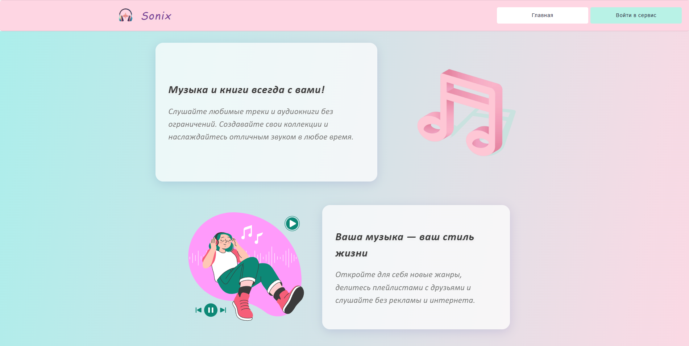
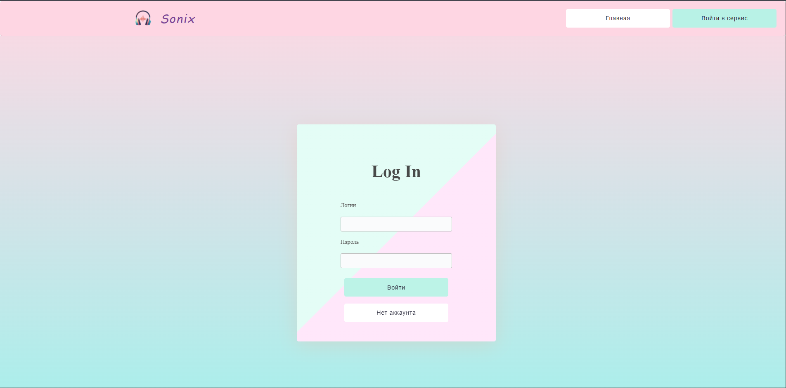
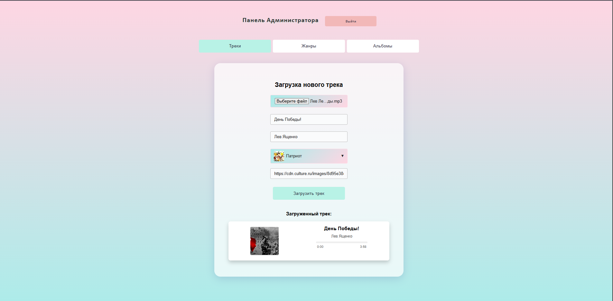
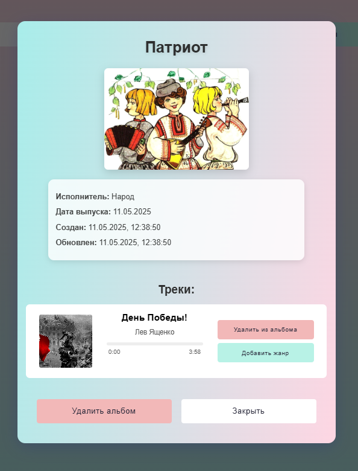
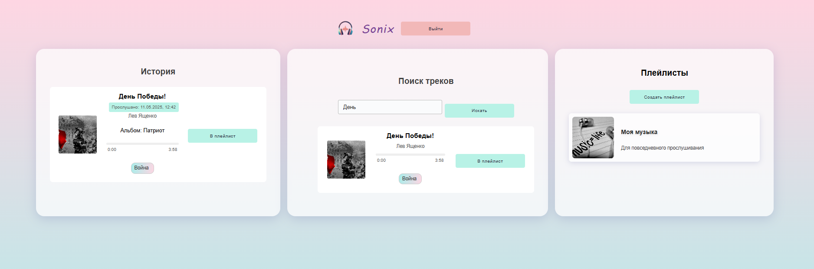
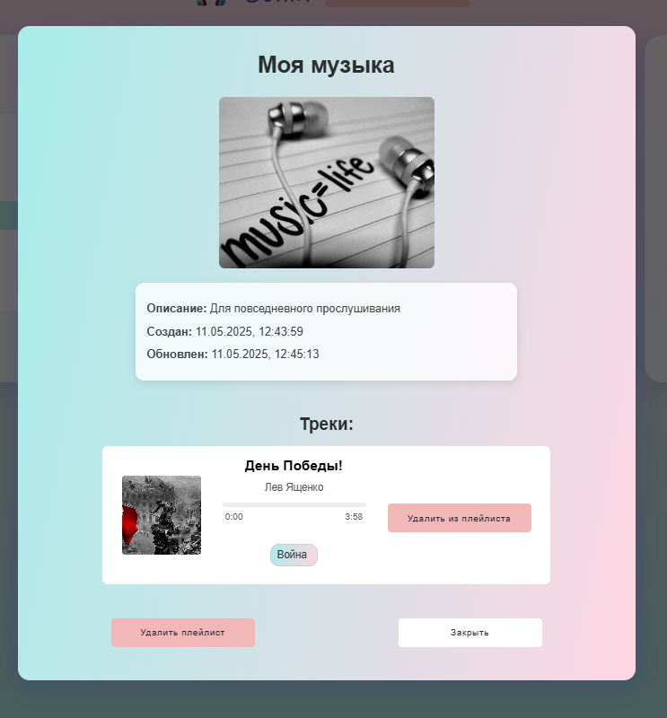

# SONIX MUSIC

*Музыкальный сервис нового поколения*

## О проекте

Образовательный проект, демонстрирующий возможности современного музыкального сервиса.
Фронтенд разработан: Николай Танев.

## Основные страницы проекта

### Главная страница


Промо-страница для описания сервиса для неавторизованных пользователей.

### Страница входа


Страница авторизации для безопасного входа.

### Загрузка трека (Администратор)


Интерфейс для загрузки нового трека администратором.

### Карточка Альбома


Подробная информация об альбоме, включая треки.

### Страница сервиса для пользователя


Персонализированный раздел с историей прослушиваний, поиском треков и созданием и редактированием плейлистов.

### Страница Плейлиста


Подробная информация о плейлисте.

```bash
# Запуск бекенда:
cd backend/
docker-compose build
docker-compose up -d

# Запуск фронтенда:
npm run dev
```
